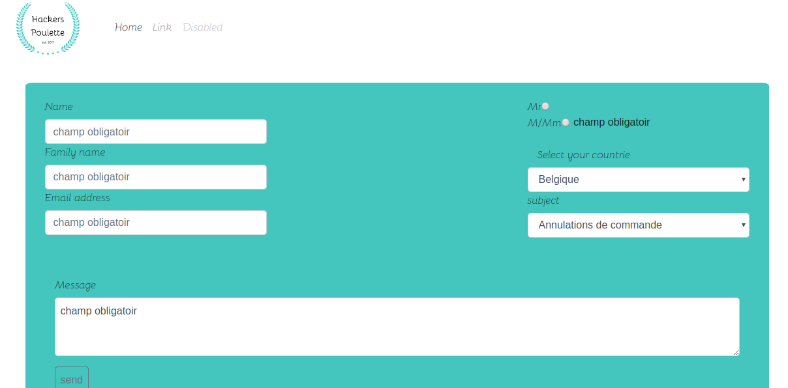

# hackers_poulette

## Forms

creation d'un formulaire en en php + recuperation la valeur de l'input de l'utilisateur 

## Santize 

Securité tous les entrées de l'utilasteur: __hacking__

## mailchimp

Quand le formulaire est completé et securisé alors il est envoié.
qui entraine un envoie automatique à l'utilisateur pour lui confirmé que son fomulaire a bien etais envoié

__functionalité__

* envoie de mail fonction mais j'utilise un mailchimps qui est gratuit, donc le quota est dépassé
